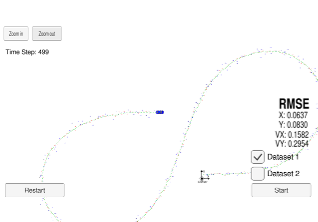

# Unscented Kalman Filter Project
Self-Driving Car Engineer Nanodegree Program

This project implements an Unscented Kalman Filter to estimate the state of a moving object of interest by fusing noisy LIDAR and RADAR measurements. The simulator used for verifying the working of the Kalman filter can be downloaded [here](https://github.com/udacity/self-driving-car-sim/releases).

The project assumes a constant turn-rate and velocity (CTRV) model of the motion of the object to be tracked. It is an improved version of the [Extended Kalman Filter Project](https://github.com/farhanhubble/Extended-Kalman-Filter-Project).

An **Unscented Kalman Filter (UKF)** uses **Unscented Transform (UT)** to tackle non-linearities in prediction or update steps of the filtering process, instead of using a linear approximation of the non-linearities as in the case of an **Extended Kalman Filter (EKF)**. 

Given a mean state vector **x** and its covariance matrix **P**, a **UT** generates a set of new state vectors of the type **x** +/- **w** * **sqrt(P)**, where **w** is some scalar weight. The new vectors are passed through the non-linearity in the prediction or update step and an equal number of vectors are obtained as output of the **UT**. The mean and covariance of the output vectors is then used in place of the mean and covariance of a real Gaussian. Our **UKF** version of the Kalman Filter gets lower RMS error than its **EKF** counterpart on the same data as seen the comparison below.

Extended Kalman Filter     |  Unscented Kalman Filter
:-------------------------:|:-------------------------:
  |   

This repository includes two files that can be used to set up and install [uWebSocketIO](https://github.com/uWebSockets/uWebSockets) for either Linux or Mac systems. For windows you can use either Docker, VMware, or even [Windows 10 Bash on Ubuntu](https://www.howtogeek.com/249966/how-to-install-and-use-the-linux-bash-shell-on-windows-10/) to install uWebSocketIO. Please see [this concept in the classroom](https://classroom.udacity.com/nanodegrees/nd013/parts/40f38239-66b6-46ec-ae68-03afd8a601c8/modules/0949fca6-b379-42af-a919-ee50aa304e6a/lessons/f758c44c-5e40-4e01-93b5-1a82aa4e044f/concepts/16cf4a78-4fc7-49e1-8621-3450ca938b77) for the required version and installation scripts.

Once the install for uWebSocketIO is complete, the main program can be built and run by doing the following from the project top directory.

1. mkdir build
2. cd build
3. cmake ..
4. make
5. ./UnscentedKF

## Other Important Dependencies

* cmake >= 3.5
  * All OSes: [click here for installation instructions](https://cmake.org/install/)
* make >= 4.1
  * Linux: make is installed by default on most Linux distros
  * Mac: [install Xcode command line tools to get make](https://developer.apple.com/xcode/features/)
  * Windows: [Click here for installation instructions](http://gnuwin32.sourceforge.net/packages/make.htm)
* gcc/g++ >= 5.4
  * Linux: gcc / g++ is installed by default on most Linux distros
  * Mac: same deal as make - [install Xcode command line tools](https://developer.apple.com/xcode/features/)
  * Windows: recommend using [MinGW](http://www.mingw.org/)

## Basic Build Instructions

1. Clone this repo.
2. Make a build directory: `mkdir build && cd build`
3. Compile: `cmake .. && make` 
   * On windows, you may need to run: `cmake .. -G "Unix Makefiles" && make`
4. Run it: `./ExtendedKF `
